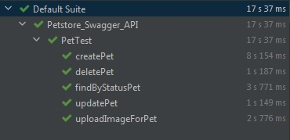

# О чем проект
Тестирование подключения к API сайта https://petstore.swagger.io/

На данном сайте предоставлены различные задания для тренировки Мануальных тестировщиков. 
Я автоматизировала выполнение данных заданий, используя Java, Maven, RestAssured, TestNG,
Jackson, Lombok.

### Для работы использованы:
#### Язык: Java 15 (JDK 15.0.2)
#### Фреймворки:
- maven-4.0.0
- rest-assured 4.4.0
- testng 7.3.0
#### Библиотеки:
- lombok 1.18.20
- jackson-databind 2.13.0  
- jackson-core 2.13.0
- jackson-annotations 2.13.0
- assertj-core 3.19.0
- hamcrest-all 1.3

#### Плагин
- RoboPOJOGenerator 2.3.2

### Структура проекта
```java/
   |-- PetTest.java
   └── pojos
       |-- CreateCategory.java
       |-- CreatePetRequest.java
       |-- CreatePetResponse.java
       |-- CreatePhotoUrls.java
       |-- CreateTagsItem.java
       └── ResponsePetImage.java
   ```
### Результат работы

